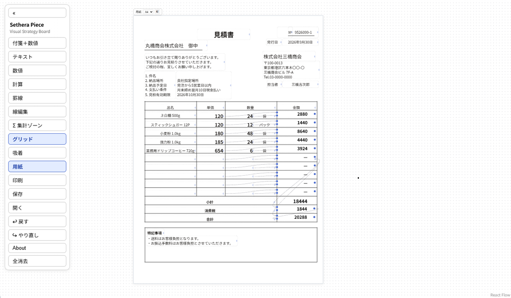

# Sethera Piece（セセラピース）

セルのない計算ボード。テキスト・数値の「ピース」を自由に置き、
集計ゾーンと計算ピースで小計・消費税・合計まで組み立てるビジュアルボードです。

> セルに縛られない「囲んで数える」発想。
> 表計算のように計算して、ホワイトボードのように動かす。



**[Live demo](https://cuculhart.github.io/sethera-piece/)** — インストール不要・ブラウザだけで動きます

変更履歴は [CHANGELOG](CHANGELOG.md) を参照（最新: v0.3.0）。

## 特徴

- **ピース** — テキスト / 数値 / 付箋＋数値。複数行入力、揃え・色・文字色・サイズ（S/M/L/LL）・太字・枠なし表示
- **計算ピース** — ＋−×÷ と端数処理（切上／切捨／四捨五入）。被演算子は線で接続、未接続の口は定数入力。結果だけのコンパクト表示・枠なしにも対応
- **集計ゾーン（Σ）** — 囲んだピースを Sum / Count / Avg / Max / Min でライブ集計。ピースの出し入れで即更新。ゾーンの結果も計算ピースの入力に使える。ゾーンに一部だけ重なって集計に効いていないピースは赤破線で警告
- **罫線** — 表組み用の水平・垂直線と矩形枠（細／太／極太／点線・前面背面・塗りつぶし）。グリッド吸着で角が結合し、隣接する矩形の辺は完全に重なる
- **カスタムピース（グループ）** — 矩形・テキスト・数値・計算をまとめてグループ化すると一体で移動する再利用単位になる。用紙の外に雛形として置き、コピー＆ペーストで用紙に貼る運用が可能（コピーはオリジナルと非連携）。Alt+ドラッグでメンバー単体の微調整もできる
- **プロパティペイン** — ピース・罫線・計算・ゾーンの属性を右側ペインで編集。複数選択で一括変更も可能
- **数値書式** — 数値・計算結果・集計結果に3桁区切りカンマ・小数桁数（自動/0〜3桁固定）・0のとき非表示・数値の太さ（細/標準/太）・負数表記（ー/()/▲/赤/赤ー）を設定可能
- **用紙＆印刷** — A4/B5/A3・縦横の用紙枠。枠の範囲をキャプチャして印刷/PDF（計算の配線は印字されません）
- **JSON 保存／読み込み** — 文書をまるごとファイル化。見積書テンプレート等の再利用に
- **Undo / Redo** — Ctrl+Z / Ctrl+Shift+Z（100ステップ）
- **線編集モード** — 罫線だけを最前面にして確実に掴める
- **設定** — 「⚙ 設定」でツールバー色の変更と Quiet モード（UI の明度を抑える）を切替。用紙はタグの「枠」で透過点線枠モードにもできる
- **完全ローカル** — データはブラウザの localStorage とJSONファイルのみ。外部送信なし

## 動かし方

```bash
npm install
npm run dev      # http://localhost:5173/sethera-piece/
npm run build    # 本番ビルド → dist/
npm run typecheck
```

React 18 + TypeScript + Vite + [@xyflow/react](https://github.com/xyflow/xyflow) (MIT) + html-to-image。

## 基本的な使い方

| やりたいこと | 操作 |
|---|---|
| ピースを追加 | ツールレールの「テキスト」「数値」「付箋＋数値」 |
| 編集 | ダブルクリック（Enter=改行、Ctrl+Enter=確定、外側クリックでも確定）、または選択して右のプロパティペインで編集 |
| 属性の一括変更 | 複数ピースを選択 → プロパティペインで色・揃え・サイズ・太字などをまとめて適用 |
| 揃える | 複数選択 → プロパティペイン「整列」で左/右/上/下・幅・高さを揃える |
| サイズ変更 | エッジをドラッグ、またはペイン「サイズ」で幅/高さを −/＋（±12）・直接入力 |
| 同時リサイズ | 複数選択してエッジをドラッグ → 同じ辺が連動（罫線の始端/終端も連動。縦⇔横の転換も一括） |
| セルに合わせる | 矩形罫線の内側にあるピースを選択 → ペイン「矩形: フィット」で矩形と同じ位置・サイズに |
| 計算 | 「計算」→ ピース右端の ● から線を引き、calc 左側の A/B に接続。未接続の口は定数入力欄 |
| 小計 | ピースを選択して「Σ 集計ゾーン」、または「Σ」ボタン→ドラッグで範囲を指定 |
| 税・合計 | ゾーン右端の ● から計算ピースへ接続（×0.1 切捨 = 消費税、税抜＋税 = 税込合計） |
| 罫線 | 「罫線」→ リサイズで水平/垂直。「矩形」で4辺の枠。「線編集」ONでピースの下の線も掴める |
| 複製 | Ctrl+C / Ctrl+V / Ctrl+D（グループのメンバーをコピーするとグループ全体が複製される） |
| グループ化／解除 | 対象を複数選択 → ペイン「グループ」で「まとめる」。Alt+ドラッグでメンバーの個別移動 |
| 戻す／やり直し | Ctrl+Z / Ctrl+Shift+Z（またはCtrl+Y） |
| 印刷 | 「印刷」または Ctrl+P（用紙枠の範囲が出力。用紙なしの場合は全体） |
| 保存／読込 | 「保存」でJSONダウンロード、「開く」で復元 |

### 見積書ワークフローの例

```text
数量 × 単価 → 明細金額 (calc)
明細行をゾーンで囲む → 税抜小計 (Σ)
ゾーン × 0.1（切捨）→ 消費税 (calc)
小計 + 消費税 → 合計 (calc)
```

罫線で表の枠を引き、ピースをセル位置に置き、
計算ピースは「コンパクト＋枠なし」で金額欄に収める、という組み方です。

## 名前について

「Sethera（囲んで数える）」+「Piece（盤上の駒）」。通称 **セセラ**。

## License

MIT © 2026 cuculhart
